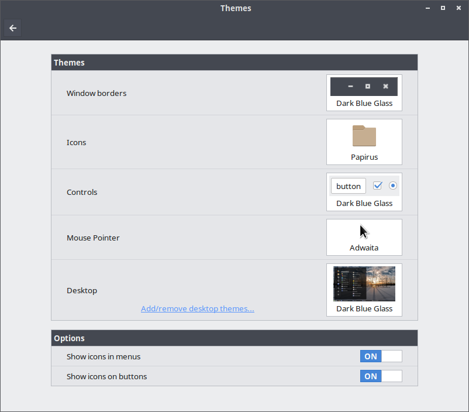
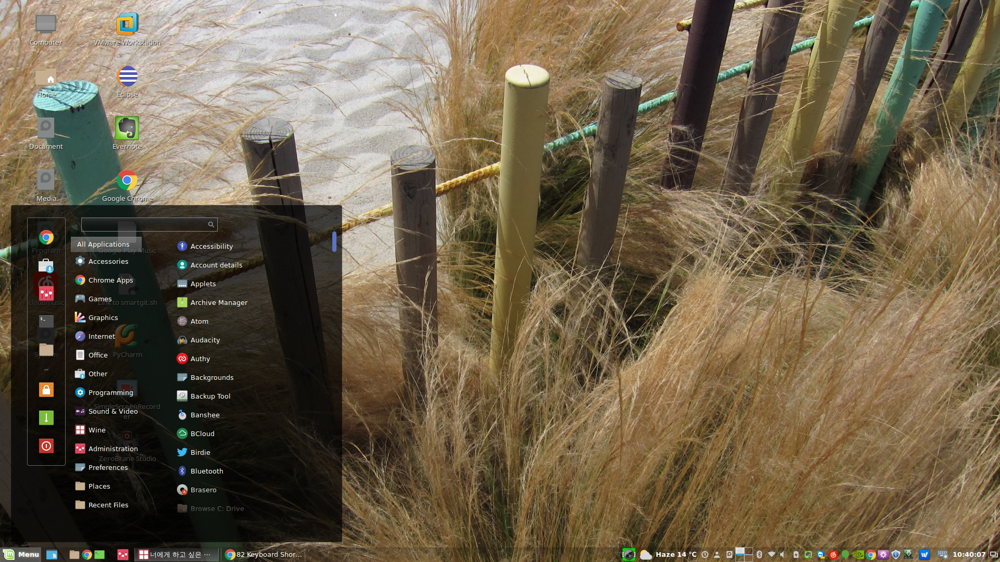
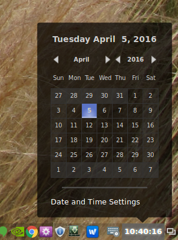
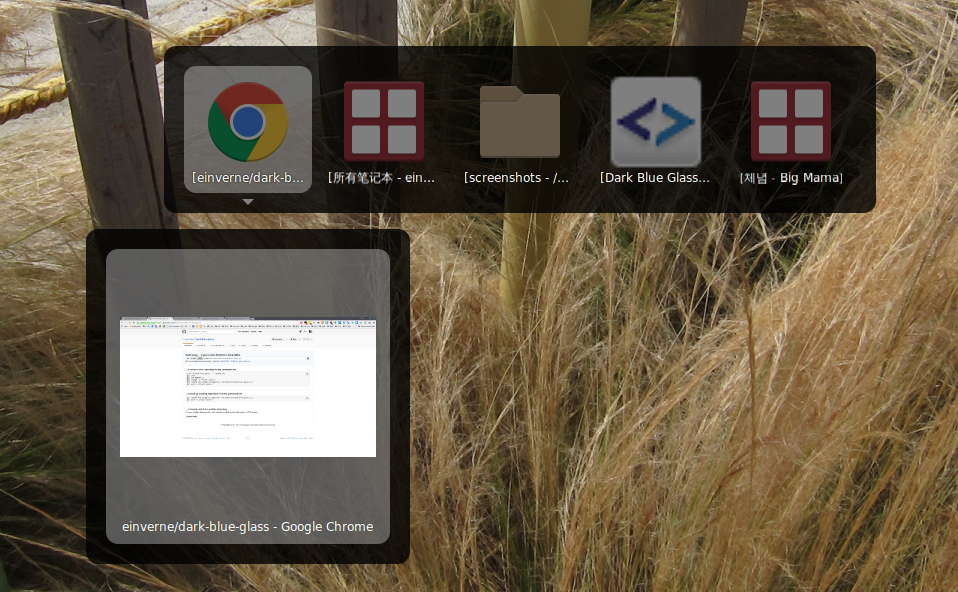
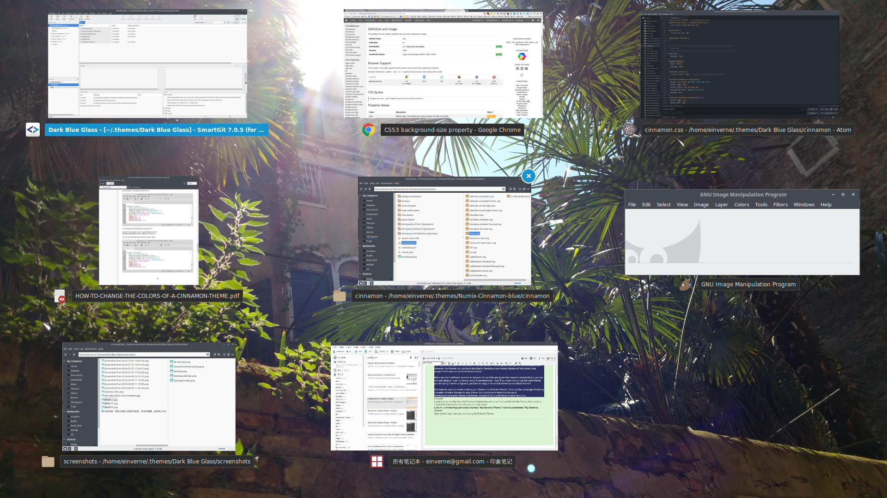
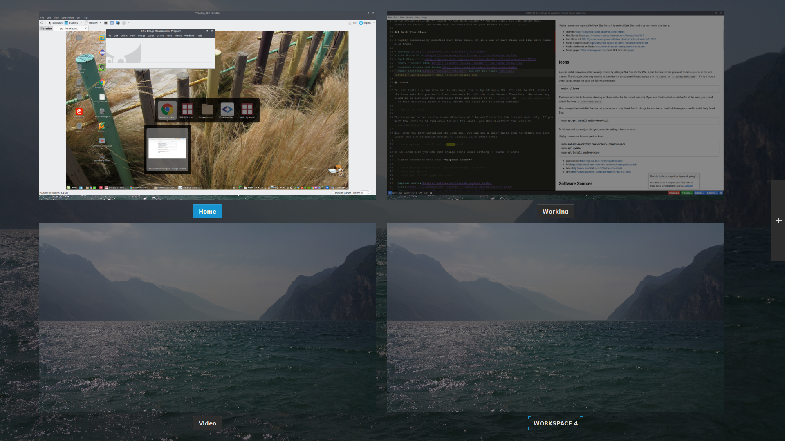

## Dark Blue Glass

A modified Cinnamon theme based on [Dark Glass](http://gnome-look.org/content/show.php/Dark+Glass?content=171257), Mint Numix blue and Numix Cinnamon blue. This theme include Window borders, Controls and Desktop. I personal use Papirus Icons and all screenshot is taken under this environment.

Cinnamon theme setting

desktop

calendar

alt tab

scale-view

workspace view

## Install

	cd ~/.theme  # if this folder not exist, create one
	git clone https://github.com/einverne/dark-blue-glass.git

Then change to this theme in system setting.

